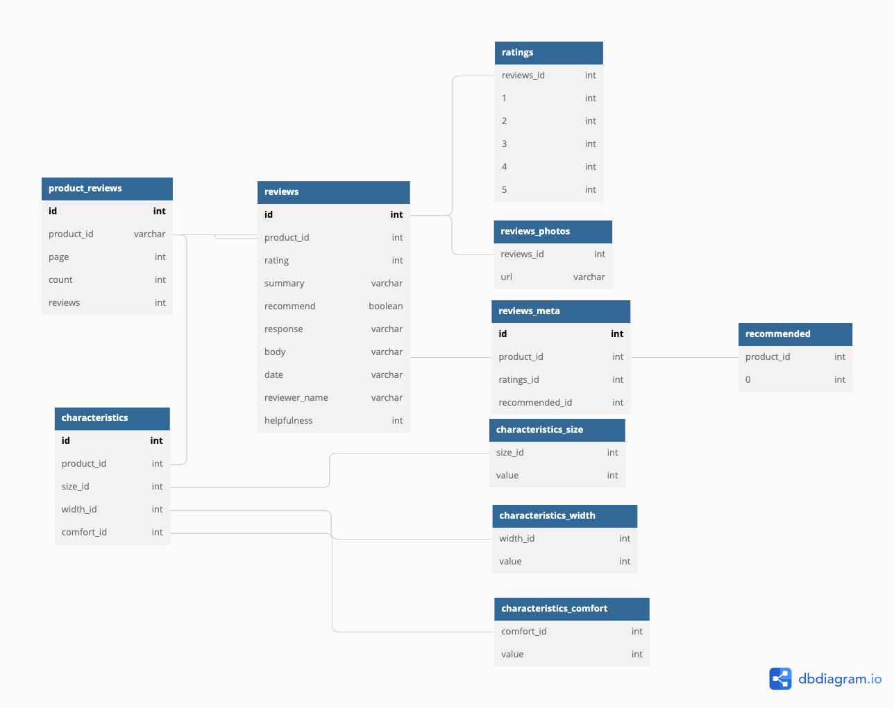
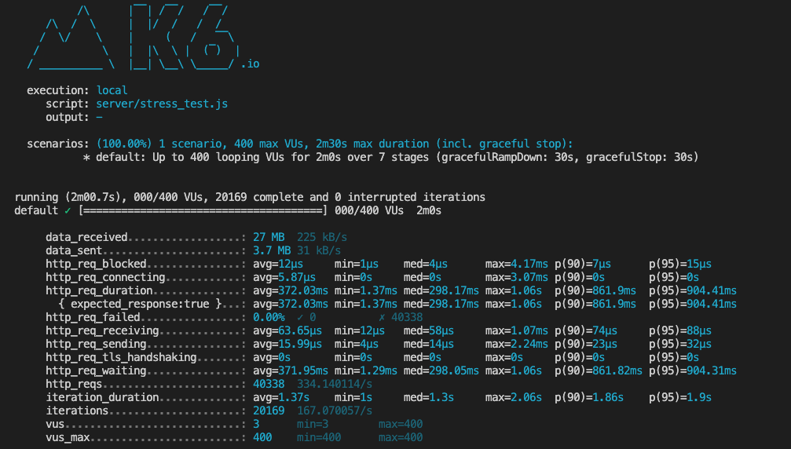
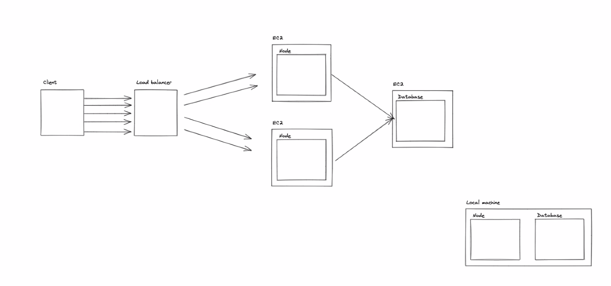
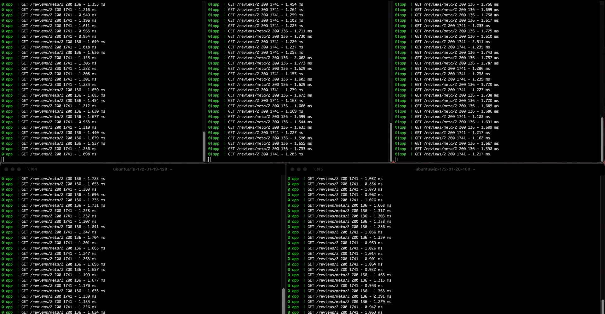

# Ratings And Reviews Backend Microservice

Atelier is a backend microservice for an ECommerce website which was scaled in AWS EC2 using an Nginx Load Balancing Server, 4 host servers and PostgreSQL database. Currenctly response times run under 70ms (down from 500ms+).

## Step 1: Relational Database Schema and Testing

After examining what the microservice data sets is going to provide, I designed a relational schema to run with PostgreSQL.

### Relational Database Schema

## Step 2: Local Stress Testing

After inherit an amount of 10 million records, local benchmarks for the service was averaged around 12.5 seconds. After indexing, query speeds were reduced to an approximately 85ms (using PgAdmin) and 53ms (using Postman). Local stress test was done with K6.io

### Query Results

| Indexing     |     Time      |
| :----------- | :-----------: |
| Without      | 12.5 seconds  |
| With/PgAdmin | 0.085 seconds |
| With/Postman | 0.053 seconds |

### K6.io Testing

## Step 3: Horizontal Scaling using Nginx Load Balancer with Round Robin algorithm hosting 5 servers on AWS

Created 4 additional AWS EC2 t2.micro instances to increase throughput by 90% by horizontally scaling utilizing NGINX loadbalancer to improve site performance and obtain a response time of under 70ms.

### Initial Horizontal Scaling Diagram

### 5 Servers simultaneously:

